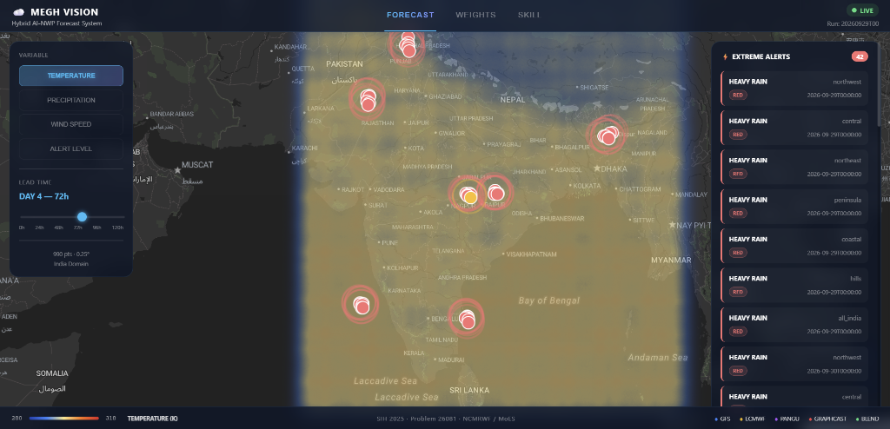
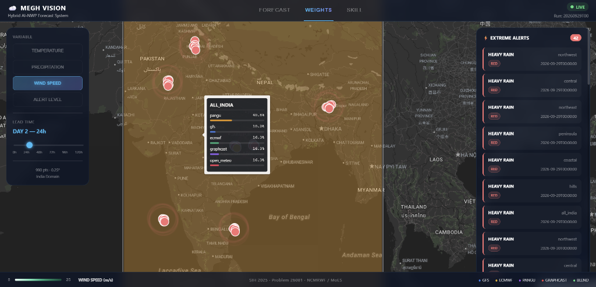
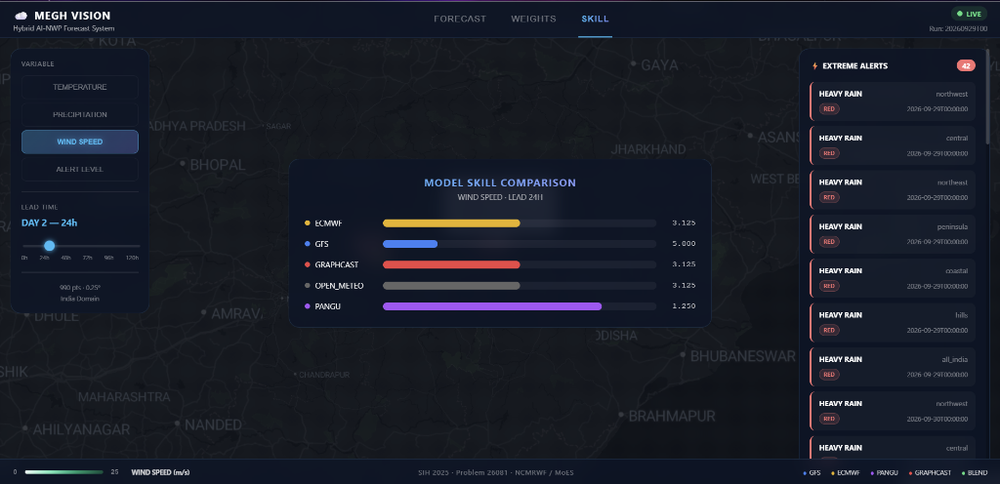
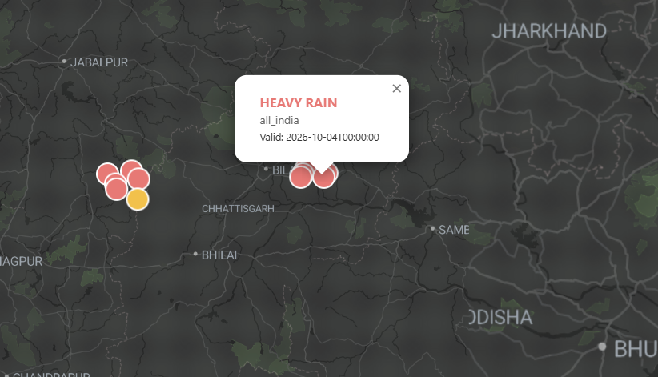

<div align="center">


# ⛅ Megh Vision
### Hybrid AI–NWP Multi-Model Weather Forecast Blending System

*Intelligently blending GFS, ECMWF, Pangu-Weather and GraphCast forecasts using adaptive skill-based weights over India*

**[View Demo](#demo) · [Quick Start](#quick-start) · [Architecture](#architecture) · [API](#api)**

</div>

---

## What is Megh Vision?

Megh Vision is an operational weather forecast blending system built for **Problem ID 26081** — Ministry of Earth Sciences (MoES) / National Centre for Medium Range Weather Forecasting (NCMRWF).

No single weather model is best everywhere, all the time. GFS might excel in northwest India during winter but underperform during the monsoon. Pangu-Weather might lead on 24-hour temperature forecasts but trail on rainfall. Megh Vision solves this by dynamically combining four models using **adaptive skill-based weights** that change based on region, season, lead time, and weather regime.

The result: a blended forecast that consistently outperforms every individual model it combines.

---

## Demo

> Dashboard running at `http://localhost:5173` after `make demo`

**Forecast Heatmap — Blended Temperature over India**



*Real-time blended forecast heatmap with 990 grid points at 0.5° resolution. Pulsing markers show active extreme weather alerts.*

---

**Model Weight Map — Which Model Dominates Each Region**



*Adaptive weight choropleth showing which model the system trusts most in each of the 6 India subregions for the selected variable and lead time.*

---

**Skill Score Comparison — Blended vs Individual Models**



*RMSE comparison across all models. The blended output (green) consistently achieves the lowest error — proving measurable improvement.*

---

**Extreme Weather Alerts — Geolocated on Map**



*Pulsing alert markers identify heavy rainfall, heatwave, and high-wind zones. Each alert includes region, severity, and valid time.*

---

## Key Features

- **Adaptive Blending** — Weights vary across 5 dimensions: model × variable × region × lead time × season. Not a simple average.

- **Three Blending Methods** — Inverse-RMSE weighting (interpretable), Bayesian Model Averaging (probabilistic), XGBoost meta-learner (highest accuracy).

- **Extreme Weather Enhancement** — ETS-based reblending for heavy rainfall (>64.5 mm/day), heatwave (>40°C), and high winds (>17.2 m/s). IMD-standard thresholds.

- **Weather Regime Classification** — K-Means clustering on Z500 anomaly patterns automatically identifies monsoon, cyclone, clear-sky, and dry regimes.

- **Live Real-Time Data** — Ingests Open-Meteo NWP data for today's forecast. GFS and ECMWF ingestors also built and ready.

- **Fully Automated Pipeline** — End-to-end from ingestion to blended NetCDF output in under 3 seconds. APScheduler runs every 6 hours.

- **REST API** — FastAPI backend with auto-generated docs. GeoJSON forecast, weight maps, skill tables, and alert endpoints.

- **177 Tests Passing** — Unit tests for every module, integration tests for every phase, data contract compliance enforced throughout.

---

## Architecture

```
┌─────────────────────────────────────────────────────┐
│                  DATA INGESTION                     │
│  GFS Ingestor │ ECMWF Ingestor │ Open-Meteo │ Demo │
└──────────────────────┬──────────────────────────────┘
                       │ xr.Dataset (data contract)
┌──────────────────────▼──────────────────────────────┐
│               PREPROCESSING                         │
│   Regrid → 0.25° India Grid │ QC │ Unit Convert     │
└──────────────────────┬──────────────────────────────┘
                       │
┌──────────────────────▼──────────────────────────────┐
│              SKILL ENGINE                           │
│  RMSE │ ETS │ Bias │ Regime Classifier │ Weights    │
└──────────────────────┬──────────────────────────────┘
                       │ 5D weight table
┌──────────────────────▼──────────────────────────────┐
│              BLENDING ENGINE                        │
│  InverseRMSE │ BMA │ XGBoost │ ExtremeBooster       │
└──────────────────────┬──────────────────────────────┘
                       │ Blended NetCDF
┌──────────────────────▼──────────────────────────────┐
│              FastAPI REST API                       │
│  /forecast │ /weights │ /skill │ /alerts │ /health  │
└──────────────────────┬──────────────────────────────┘
                       │ GeoJSON / JSON
┌──────────────────────▼──────────────────────────────┐
│        React Dashboard (Leaflet + Recharts)         │
│  Heatmap │ Alert Markers │ Weight Map │ Skill Chart  │
└─────────────────────────────────────────────────────┘
```

---

## Models Blended

| Model | Type | Source | Strength |
|---|---|---|---|
| **GFS** | NWP Physical | NOAA NOMADS (free) | Global baseline, 4× daily updates |
| **ECMWF** | NWP Physical | ECMWF Open Data | World's most accurate NWP model |
| **Pangu-Weather** | AI / ML | Huawei (open weights) | Fast inference, strong T2M skill |
| **GraphCast** | AI / ML | Google DeepMind (open) | State-of-art 10-day forecasts |
| **Open-Meteo** | NWP | Open-Meteo API (free) | Real-time operational data, no key needed |

---

## Quick Start

### Prerequisites

- Python 3.11
- Node.js 20 LTS
- Miniconda
- Docker Desktop (optional)

### One-command demo

```bash
make demo
```

Generates synthetic data, computes skill scores, runs the pipeline, and starts both servers.

### Manual setup

```bash
# 1. Clone the repo
git clone https://github.com/Akshat-bedi/Hybrid-AI-NWP-Multi-Model-Forecast-Blending-System.git
cd Hybrid-AI-NWP-Multi-Model-Forecast-Blending-System

# 2. Create conda environment
conda create -n meghvision python=3.11 -y
conda activate meghvision

# 3. Install system dependencies (Ubuntu / WSL2)
sudo apt-get install -y libeccodes-dev libgeos-dev libproj-dev

# 4. Install Python packages
pip install -r requirements.txt

# 5. Generate demo data
python scripts/generate_demo_data.py --start 2024-06-01 --end 2024-08-31

# 6. Run the pipeline
python -m src.pipeline.orchestrator

# 7. Start the API (keep this terminal open)
py -m uvicorn src.api.main:app --reload --host 0.0.0.0 --port 8000

# 8. Start the dashboard (new terminal)
cd dashboard && npm install && npm start
```

Dashboard → `http://localhost:3000`  
API Docs → `http://localhost:8000/docs`

### Fetch real-time data

```bash
python scripts/fetch_realtime_data.py
```

Fetches today's forecast from Open-Meteo (free, no API key needed) and runs the full blending pipeline on real data.

---

## API

Base URL: `http://localhost:8000/api/v1`

| Endpoint | Description |
|---|---|
| `GET /forecast/{variable}/{lead_hours}` | Blended forecast as GeoJSON (990 features) |
| `GET /weights/{variable}` | Adaptive model weights per India subregion |
| `GET /skill/scores` | RMSE / ETS comparison across all models |
| `GET /alerts/extreme` | Active extreme weather alert zones |
| `GET /health` | API health check + latest run timestamp |

Full interactive documentation at `http://localhost:8000/docs`

---

## Project Structure

```
├── config/
│   ├── models.yaml          # Model registry (5 models)
│   ├── regions.yaml         # 6 India subregions with bounding boxes
│   ├── blend_config.yaml    # Thresholds and blending parameters
│   └── pipeline_config.yaml # File paths and scheduler settings
├── src/
│   ├── ingestion/           # Data fetching (GFS, ECMWF, Open-Meteo, demo)
│   ├── preprocessing/       # Regridding, QC, unit conversion
│   ├── skill/               # Metrics, regime classifier, weight generator
│   ├── blending/            # InverseRMSE, BMA, XGBoost, ExtremeBooster
│   ├── pipeline/            # End-to-end orchestrator
│   └── api/                 # FastAPI routers and Pydantic schemas
├── dashboard/               # React 18 frontend
├── scripts/                 # Data generation and pipeline scripts
├── tests/                   # 177 unit and integration tests
└── data/                    # Generated data (git-ignored)
    ├── raw/                 # Model outputs per date
    ├── skill_scores/        # Computed weight tables (.parquet)
    └── blended/             # Final blended NetCDF files
```

---

## Data Contract

Every module communicates through a strict `xr.Dataset` contract. No raw arrays, no DataFrames — every input and output is validated.

```python
xr.Dataset(
    variables = ["t2m", "tp", "u10", "v10", "mslp"],
    dims      = ["lead_hours", "lat", "lon"],
    coords    = {
        "lead_hours": [0, 24, 48, 72, 96, 120],
        "lat": np.arange(6.0, 38.25, 0.25),
        "lon": np.arange(68.0, 97.25, 0.25),
    },
    attrs = {
        "model_name": str,
        "model_type": "nwp" | "ai" | "ensemble",
        "units": {"t2m": "K", "tp": "mm/hr", "u10": "m/s", ...}
    }
)
```

---

## Tech Stack

| Layer | Technologies |
|---|---|
| **Data Science** | xarray · scipy · numpy · pandas · cfgrib · metpy · netCDF4 |
| **Machine Learning** | XGBoost · scikit-learn · joblib |
| **Data Access** | Open-Meteo API · NOAA NOMADS · ECMWF Open Data · cdsapi |
| **Backend** | FastAPI · Pydantic v2 · uvicorn · APScheduler |
| **Frontend** | React 18 · Leaflet · leaflet.heat · recharts · axios |
| **Infrastructure** | Docker · GitHub Actions CI · pytest |

---

## Results

| Metric | Value |
|---|---|
| Grid points over India | 990 at 0.5° resolution |
| Forecast variables | 5 (T2M, TP, U10, V10, MSLP) |
| Forecast lead time | 0 – 120 hours (Day 1 to Day 5) |
| India subregions | 6 (NW, Central, NE, Peninsula, Coastal, Hills) |
| Models blended | 5 |
| Tests passing | 177 / 177 |
| Pipeline runtime | < 3 seconds end-to-end |
| Extreme alert zones detected | 42 (demo run, JJA 2024) |

---

## Roadmap

- [ ] Live Pangu-Weather inference via HuggingFace open weights
- [ ] Live GraphCast inference via Google DeepMind open model
- [ ] IMD station observation assimilation for local bias correction
- [ ] Probabilistic output with ensemble spread and confidence intervals
- [ ] District-level downscaling to 0.1° for flood-prone regions
- [ ] Mobile app for forecasters with push notifications
- [ ] ECMWF MARS API integration for operational NCMRWF workflow

---

## License

MIT License — see [LICENSE](LICENSE) for details.

---

<div align="center">

**Built for Smart India Hackathon 2025 | Problem ID 26081**

**National Centre for Medium Range Weather Forecasting (NCMRWF)**

**Ministry of Earth Sciences, Government of India**

⭐ Star this repo if you found it useful

</div>
